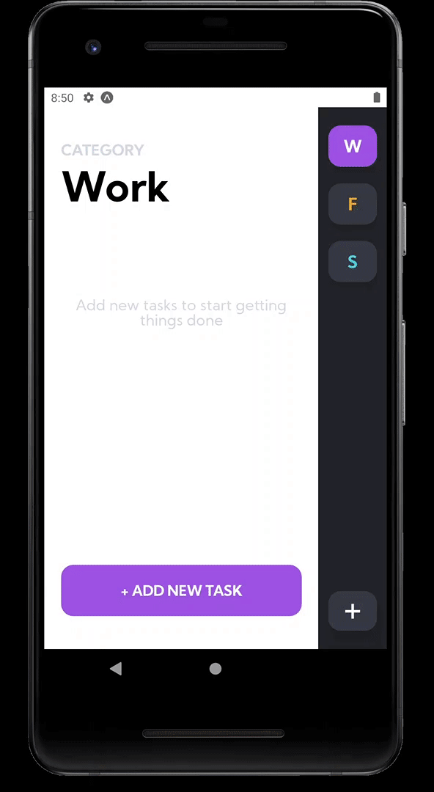

# React Native Tasks Management App

In this project I have use what I learned in the CS50M React Native course to build a task management app. The app is built using redux to manage the states of all the screens, also it uses react-navigation library to move through the different views and functionalities.
I also used Expo and react-native-community components such as Picker, DateTime, FlashMessage and icons.

This app design is inspired in the one made by [Kate Pavlenko](https://dribbble.com/shots/8585107-To-do-list-Mobile-application) 

